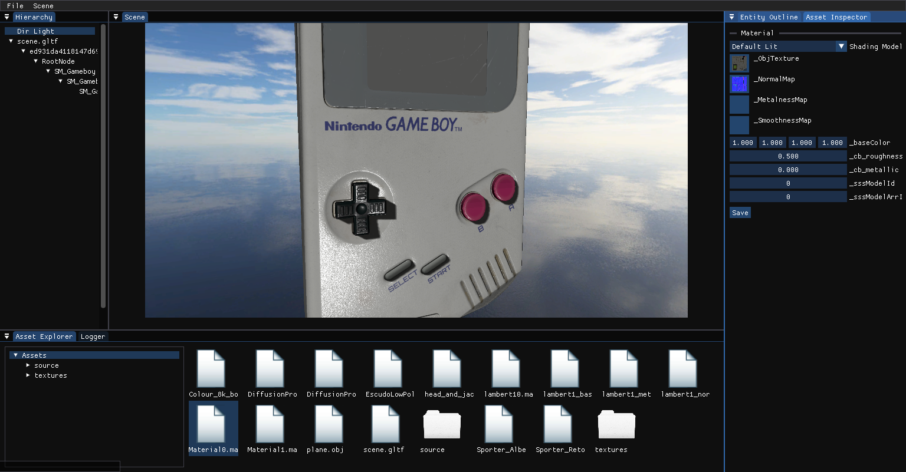
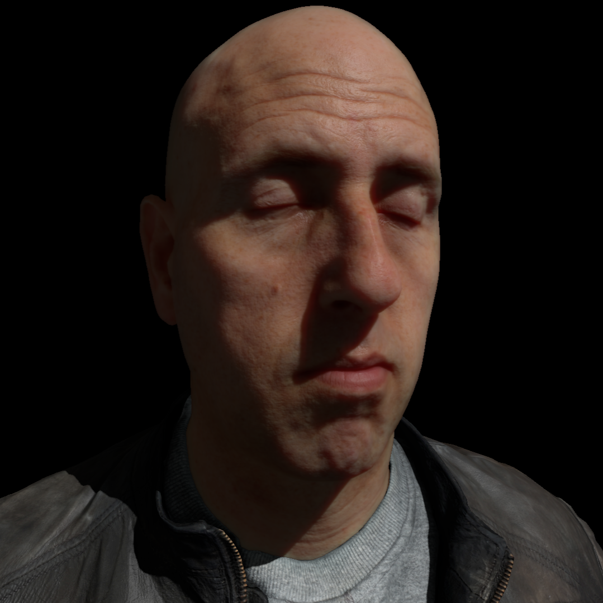
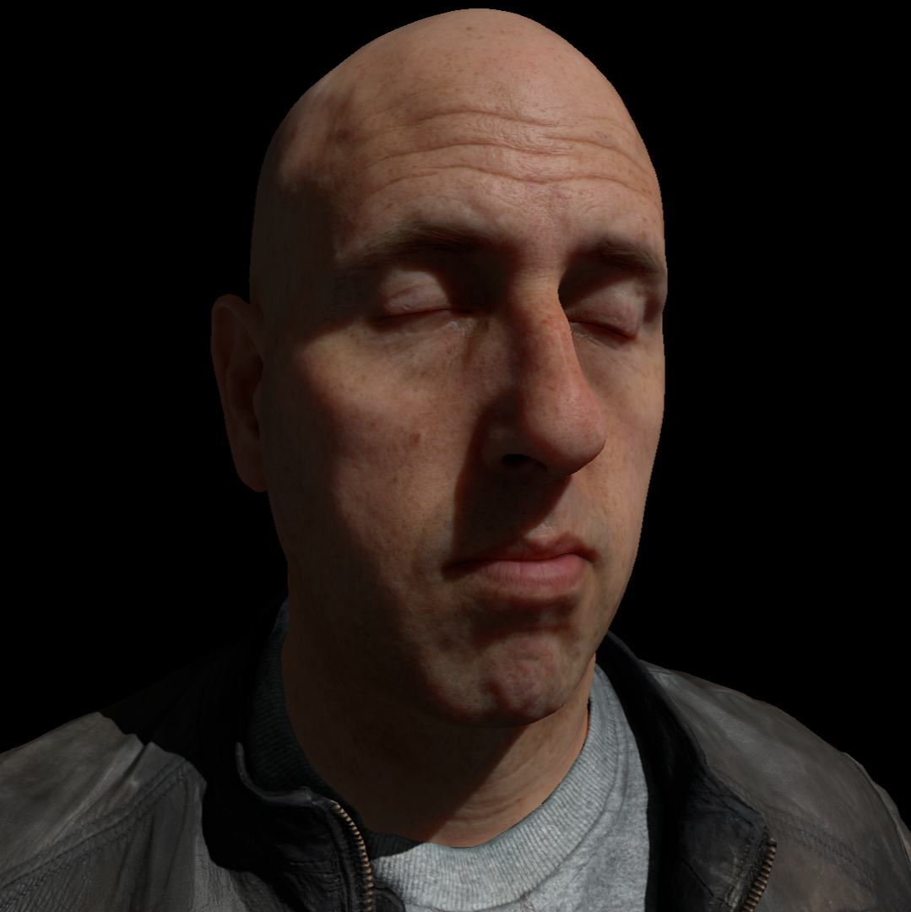
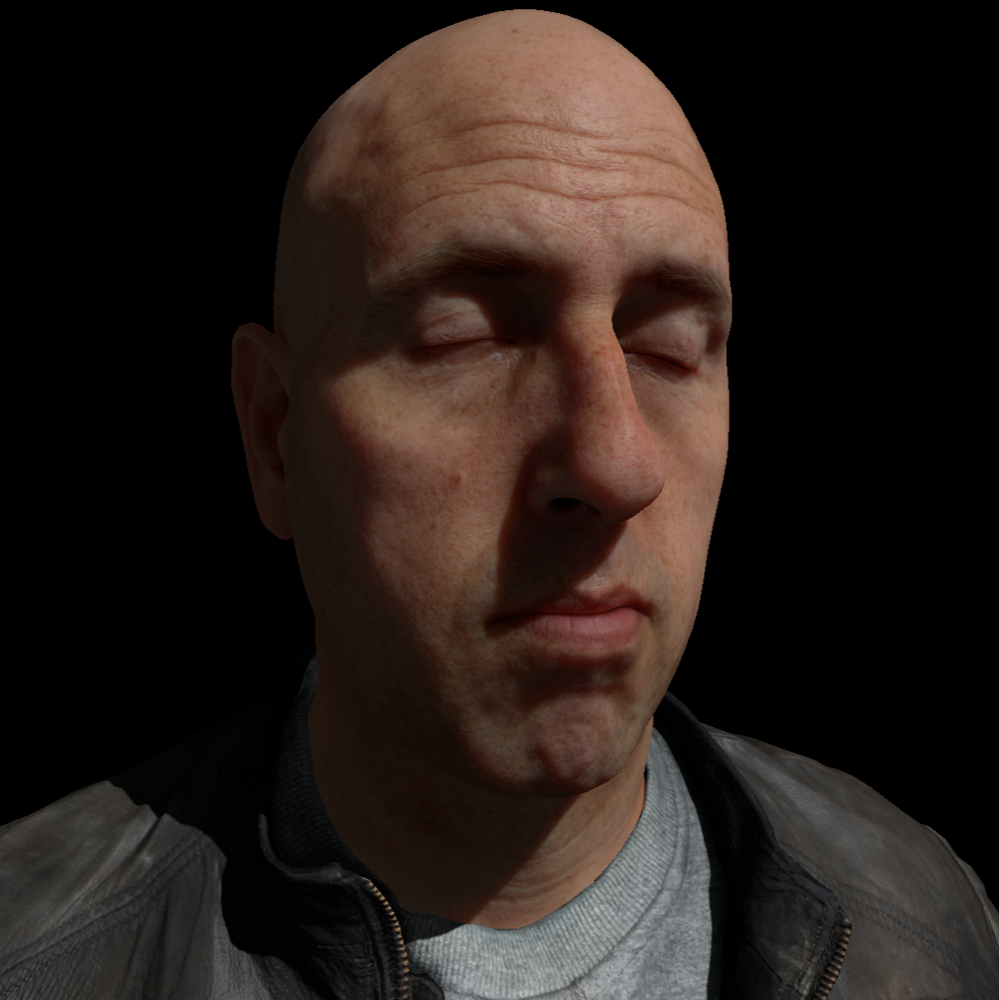


[Github Repository](https://github.com/nagard98/zorya-renderer)


**Warning! It's still a work in progress, far from being stable.**

A DX11 real-time renderer developed as a way to experiment with interesting rendering and engine features. Uses a **Render Graph** to ease the implemenentation of new features by automatically managing transient resources (currently only textures, not constant buffers). One of the main features is the presence of multiple **subsurface scattering** techniques. Planning to also integrate a DX12 backend.

## Features
- Deferred Renderer
- Phisically Based Rendering
- Render Graph for management of transient resources (inspired by Frostbite's [Halcyon Engine](https://media.contentapi.ea.com/content/dam/ea/seed/presentations/wihlidal-halcyonarchitecture-notes.pdf) )
- Abstract Render Command List
- Subsurface scattering algorithms
- Directional, Point & Spot lights 
- Shader Reflection

## Subsurface Scattering

Multiple subsurface scattering techniques are supported, specifically:
- Jimenez Gaussian [[Jim09]](https://doi.org/10.1145/1609967.1609970)
- Jimenez Separable [[Jim15]](https://doi.org/10.1111/cgf.12529)
- Golubev [[Gol18]](https://advances.realtimerendering.com/s2018/Efficient%20screen%20space%20subsurface%20scattering%20Siggraph%202018.pdf)
- Golubev Plus (an extension developed during my [thesis](thesis.pdf) that improves performance, while keeping the quality approximately the same)

|| | ||
|:-:|:-:|:-:|:-:|

## Planning
Some of the features with highest priority that I plan to implement:
- DX12 backend
- Surfel based Global Illumination
- Screen Space Shadows (Contact Shadows)
- SSAO
- SSR
- Volumetric Rendering
- Water Rendering
- Virtual Geometry (maybe)

## 3rd Party Libraries
The external libraries used inside this project:
- assimp
- stb_image
- xxHash
- imgui
- libyaml
- DirectXMath