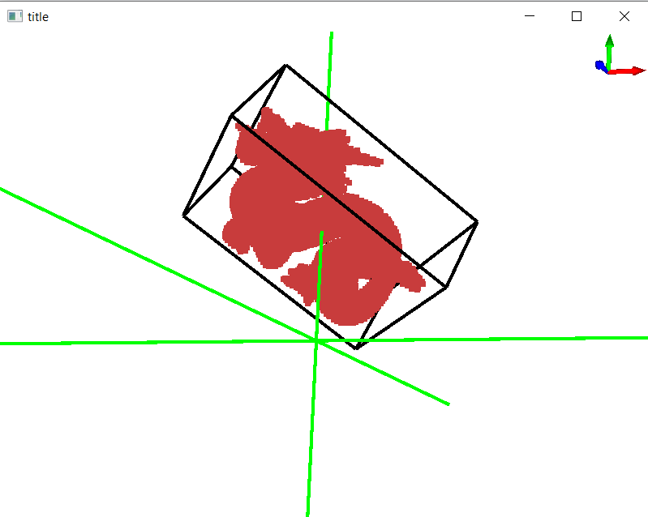
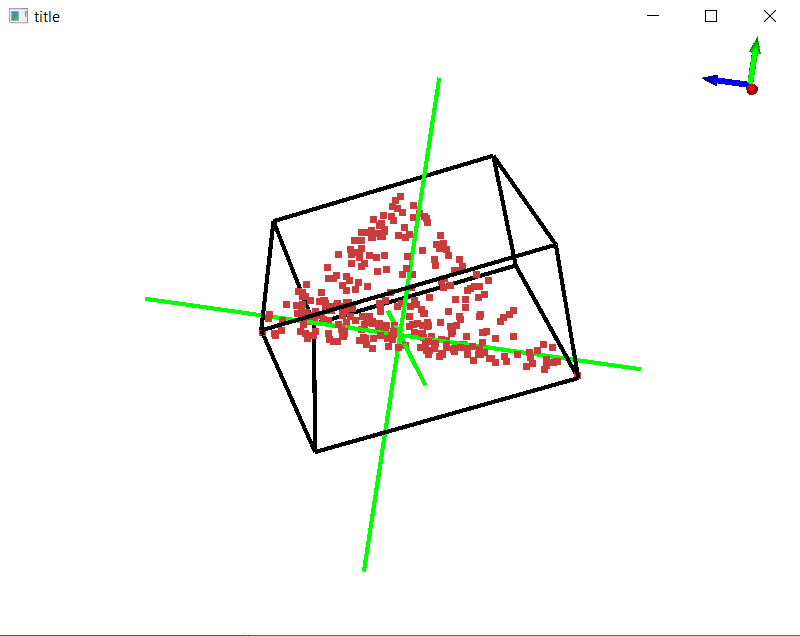


[Github Repository](https://github.com/nagard98/approx-MVBB)    


Tool for computing and visualizing an approximate Minimum Volume Bounding Box (MVBB) given a 3D Model. The algorithm is based on the ''**Efficiently Approximating the Minimum-Volume Bounding Box of a Point Set in Three Dimensions**'' [paper](https://doi.org/10.1006/jagm.2000.1127) from Barequet and Har-Peled. For some internal algorithms I used those provided with the CGAL library.

Currently supports only 3D models in the PLY format. The window creation and content rendering is done through Qt.

### Requirements
- CGAL
- Qt5
- cmake

The easier way to install CGAL and Qt5 is through vcpkg. It's not necessary to install all Qt components, its sufficient to use this command.

```
vcpkg install cgal[qt]
```

| | |
|:-:|:-:|