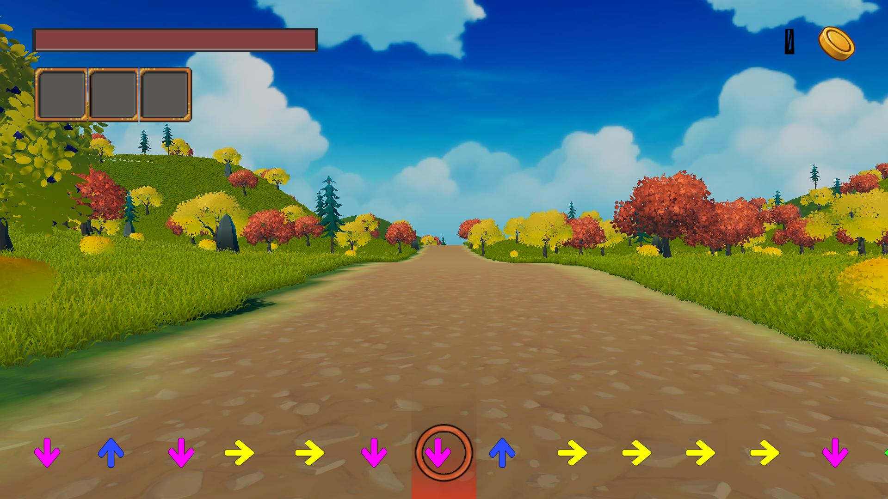
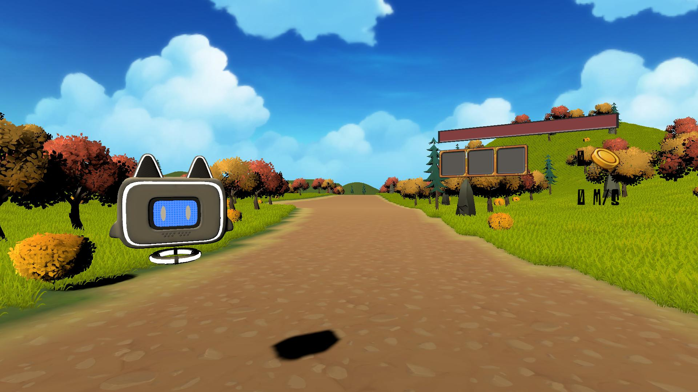

<i class="fab fa-github"></i>


[Github Repository](https://github.com/nagard98/MonstersAndGold)


Exergame developed in **Unity** during my internship at the HCI Lab of the University of Udine. The game was initially designed for old mobile devices and my job was to implement it with current technolgies and add support for a **VR headset** and **treadmill**, allowing for full body movement.

The main point of the project was to convert a 2D [exergame](http://hcilab.uniud.it/images/stories/publications/2010-09/MonsterAndGoldMobileAdaptiveFitnessGame_IEEEPervasiveComputing2010.pdf) developed by Prof. Buttussi and Prof. Chittaro in 2010 for smartphones to a modern version. Actually there are **two versions**, one for use with "normal" HIDs (with the main game loop being a **rythm game**), while the other one uses a **KAT VR Treadmill**. These two versions have their own branches in this repository.

| | |
|:-:|:-:|
|Standard version of the game| VR version of the game |

The objective of the game is to make the user keep the "right" pace by using a reward system. The rewards and the "punishments" are determined by the average page during a certain section. Specifically:
* if the users pace is below the average range, spawn some gold coins that will disappear if the user doesn't speed up
* if the users pace is inside the average range, spawn potions or shields
* if the users pace is above the average range, spawn some monsters along the road. If the user doesn't slow down he will take damage, unless he has an adequate shield.

When something spawns, in the standard version an alert appears on screen. For the VR version, instead, a text-to-speech service is used for the alerts.

The running path is procedurally generated. In the standard version of the game the character is on a rail and follows the path, with the speed beeing influenced by how good you are being at the rythm game. In the VR mode, of course, you have complete control of the character through the use of the treadmill.