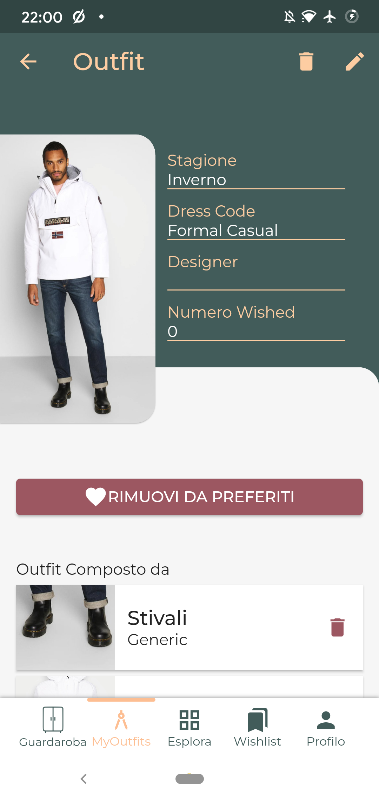
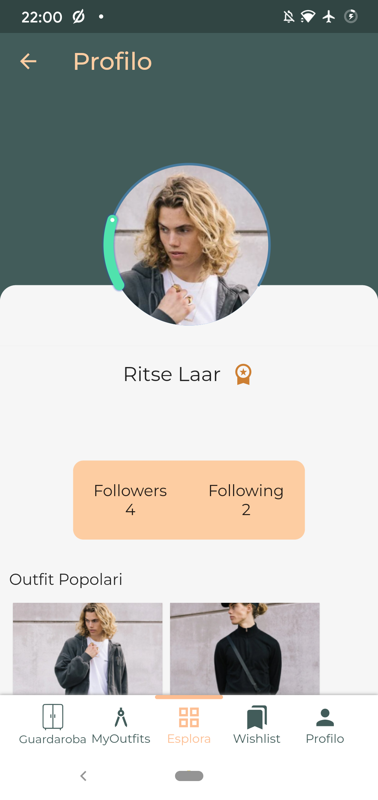
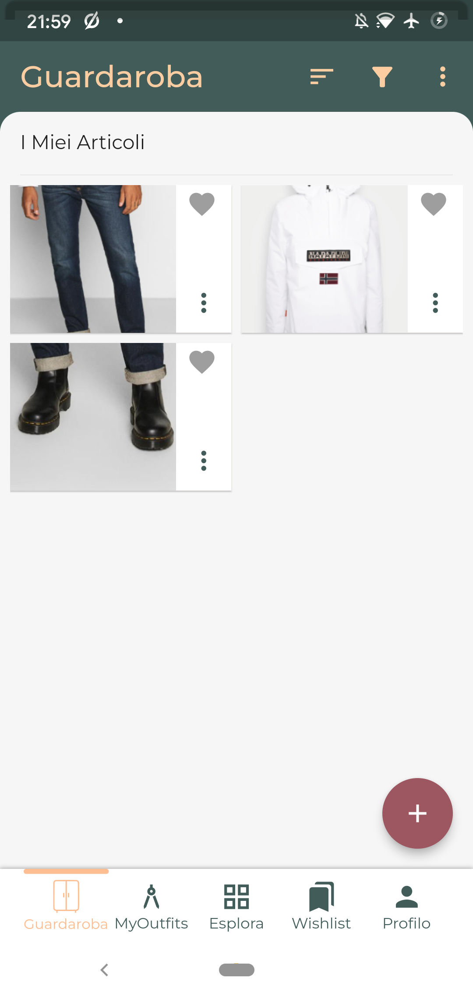


[Github Repository](https://github.com/nagard98/wardrobe-geek)


Prototype of an application for managing your own wardrobe and sharing it with other users. You can create your own outfits from single clothing items or add directly those created by other users. There is also a badge system for users that share the most popular outfits.

Developed with the Flutter framework, allowing for easy distribution on multiple different platforms.

| | | |
|:-:|:-:|:-:|